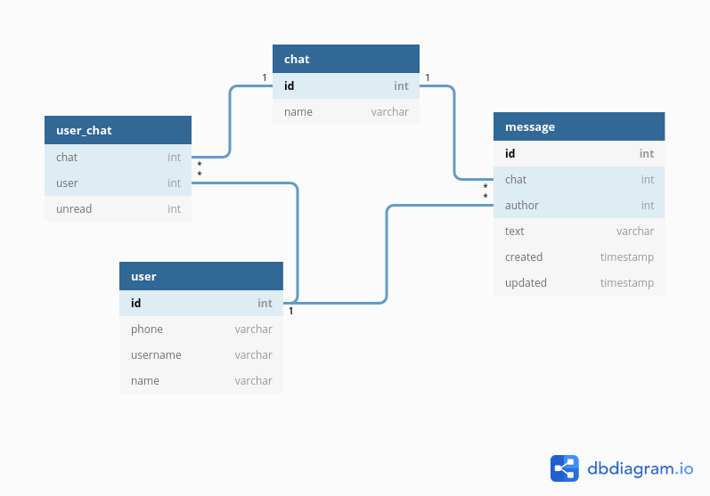

# Курсовой проект по курсу HighLoad

## Содержание

[1. Выбор темы](#1)  
[2. Определение возможного диапазона нагрузок подобного проекта](#2)  
[3. Выбор планируемой нагрузки](#3)  
[4. Логическая схема базы данных](#4)  
[5. Физическая система хранения](#5)  
[6. Выбор прочих технологий](#6)  
[7. Расчет нагрузки и потребного оборудования](#7)  
[8. Выбор хостинга / облачного провайдера и расположения серверов](#8)  
[9. Схема балансировки нагрузки](#9)  
[10. Обеспечение отказоустойчивости](#10)  

## 1.  Выбор темы

Мессенджер (Telegram).

## 2.  Определение возможного диапазона нагрузок подобного проекта

Ежедневная аудитория: [4.4 млн](https://exlibris.ru/news/telegram-2020-auditoriya-i-kanaly/).  
Среднее время пользования сервисом: [7 минут в день](https://exlibris.ru/news/telegram-2020-auditoriya-i-kanaly/).

## 3.  Выбор планируемой нагрузки

Ежедневно пользователи Telegram отправляют [70 млрд](https://relayto.com/relayto/telegram-open-network-ton-ico-whitepaper-6kf4rycn/pdf) сообщений.  
Наибольшая активность аудитории в час - [4.5%](https://popsters.ru/blog/post/aktivnost-auditorii-v-socialnyh-setyah-issledovanie-2019) дневного трафика.  

Запросов в пиковый час: `70,000,000,000 * 4.5% = 3,150,000,000`.  
Запросов в минуту: `3,150,000,000 / 60 = 52,500,000`.  
Запросов в секунду: `52,500,000 / 60 = 875,000`.

## 4.  Логическая схема базы данных

## 5.  Физическая система хранения

## 6.  Выбор прочих технологий

## 7.  Расчет нагрузки и потребного оборудования

## 8.  Выбор хостинга / облачного провайдера и расположения серверов

## 9.  Схема балансировки нагрузки

## 10.  Обеспечение отказоустойчивости