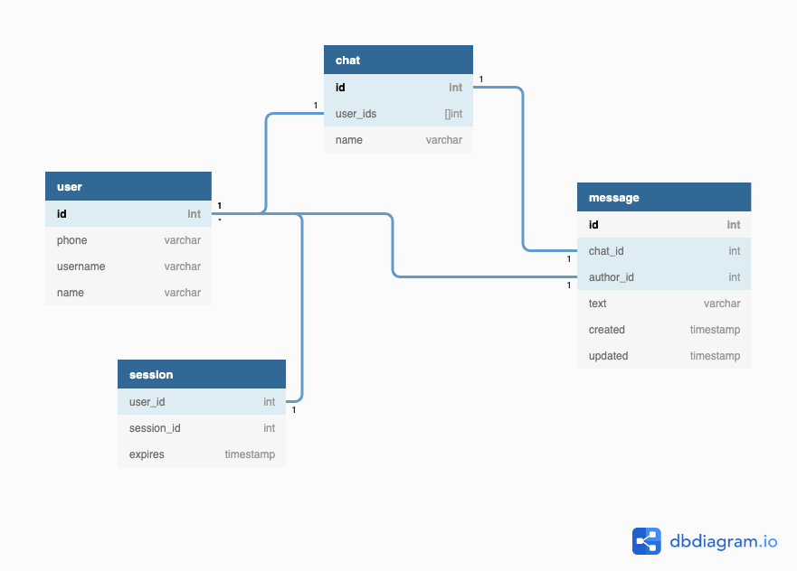

# Курсовой проект по курсу HighLoad

## Содержание

[1. Выбор темы](#1)  
[2. Определение возможного диапазона нагрузок подобного проекта](#2)  
[3. Выбор планируемой нагрузки](#3)  
[4. Логическая схема базы данных](#4)  
[5. Физическая система хранения](#5)  
[6. Выбор прочих технологий](#6)  
[7. Расчет нагрузки и потребного оборудования](#7)  
[8. Выбор хостинга / облачного провайдера и расположения серверов](#8)  
[9. Схема балансировки нагрузки](#9)  
[10. Обеспечение отказоустойчивости](#10)  

## 1.  Выбор темы

Мессенджер (Telegram).

## 2.  Определение возможного диапазона нагрузок подобного проекта

Доля пользователей из России: [73%](https://exlibris.ru/news/telegram-2020-auditoriya-i-kanaly/).  

Ежедневная аудитория: [4.4 млн](https://exlibris.ru/news/telegram-2020-auditoriya-i-kanaly/).  
Среднее время пользования сервисом: [7 минут в день](https://exlibris.ru/news/telegram-2020-auditoriya-i-kanaly/).

## 3.  Выбор планируемой нагрузки

Ежедневно пользователи Telegram отправляют [70 млрд](https://relayto.com/relayto/telegram-open-network-ton-ico-whitepaper-6kf4rycn/pdf) * 0.73 = 51.1 млрд сообщений.  

Запросов в час: `51,100,000,000 / 24 = 2,129,166,667`.  
Запросов в минуту: `2,129,166,667 / 60 = 35,486,111`.  
Запросов в секунду: `35,486,111 / 60 = 591,435`.

## 4.  Логическая схема базы данных

## 5.  Физическая система хранения

Для хранения сообщений и чатов будем использовать PostgreSQL.
Его преимущество над другими реляционными СУБД в более надежных и эффективных механизмах транзакции и репликации.  
Так как один сервер PostgreSQL не выдержит планируемую нагрузку, выполним шардинг таблицы сообщений.
Шардинг таблицы сообщений будем выполнять по полю user_id.

Текущие сессии пользователей будем хранить в Redis.
Он хранит все данные в памяти, что сильно увеличивает производительность в сравнении с реляционными СУБД.
В отличие от аналогов Redis позволяет хранить не только строки, но и более сложные типы данные: массивы, словари и множества.
Redis поддерживает master-slave репликацию, которая не приводит к блокировке ни главного, ни подчиненных серверов.

## 6.  Выбор прочих технологий

Для фронтенда будем использовать JavaScript/TypeScript.

Бэкенд будем писать на языке Golang, так как он имеет:
- простой синтаксис;
- удобную обработку многопоточности;
- интеграцию с выбранной базой данных.

Для общения между микросервисами на бэкенде будем использовать протокол gRPC.

## 7.  Расчет нагрузки и потребного оборудования

**Фронтенд**

Для объема фронтенда не больше 3 МБ и известной ежедневной аудитории получим
`3 * 4.4 * 1e6 = 13.2 * 1e6 МБ/день = 152 МБ/с`

**База данных**

Рассчитаем средний объем одной записи в таблицах базы данных.

*message*

Среднюю длину сообщения возьмем за 80 символов.

&nbsp; | id | chat | author | text | created | updated | Итого
--- | --- | --- | --- | --- | --- | --- | ---
Объем (байт) | 8 | 8 | 8 | 80 | 8 | 8 | 120

*user*

&nbsp; | id | phone | username | name | Итого
--- | --- | --- | --- | --- | ---
Объем (байт) | 8 | 16 | 32 | 32 | 88

*chat*

За среднее количество пользователей в чате примем 3 человека.

&nbsp; | ids | name | Итого
--- | --- | --- | ---
Объем (байт) | 32 | 32 | 64

Зная количество ежедневно отправляемых сообщений вычислим объем для их записи в базу за один месяц:
`30 * 120 * 51.1 * 1e9 = 183.96 * 1e12 байт = 171,326 ГБ`

На данный момент количество пользователей сервиса равно 400 млн человек.
Ежедневно регистрируется около 1.5 млн новых пользователей.
Тогда объем для записей пользователей:
`30 * 88 * 400 * 10e6 = 1.1 * 10e12 байт = 983 ГБ`

**Балансировщик**

В качестве балансировщика будет выступать nginx.
Для нагрузки в 875,000 rps выберем сервер с [32 ядрами](https://www.nginx.com/blog/testing-the-performance-of-nginx-and-nginx-plus-web-servers/).
На случай сбоев возьмем один дополнительный сервер.

**Итоговое оборудование**

&nbsp; | CPU (cores) | RAM (GB) | SSD (GB) | Количество
--- | ---: | ---: | ---: | ---:
Фронтенд | 16 | 32 | 1024 | 2
Сообщения (master) | 16 | 64 | 8192 | 22/месяц
Сообщения (slaves) | 16 | 64 | 8192 | 44/месяц
Авторизация (master) | 16 | 32 | 2048 | 2
Авторизация (slaves) | 16 | 32 | 2048 | 4
Redis | 16 | 32 | 1024 | 3
Балансировщик | 32 | 64 | 1024 | 2

## 8.  Выбор хостинга / облачного провайдера и расположения серверов

Так как основная часть российской аудитории расположена в европейской части, расположим все сервера в Москве.

## 9.  Схема балансировки нагрузки

Нагрузку балансируем при помощи nginx с использованием схемы L7.
С помощью алгоритма Round Robin будем выбирать сервер, на который будет отправлен запрос.

## 10.  Обеспечение отказоустойчивости

Для обеспечения отказоустойчивости будем использовать репликацию master-slave - по 2 реплики на каждый сервер.
Данные на репликах будут появляться с некоторой задержкой от мастера.
Поэтому мастер будет отвечать за изменение, а реплики - за их чтение.
При выходе из строя мастера, одна из реплик станет им и будет принимать операции на изменение.
Если же выйдут из строя реплики, то все запросы будут направляться только в мастер.